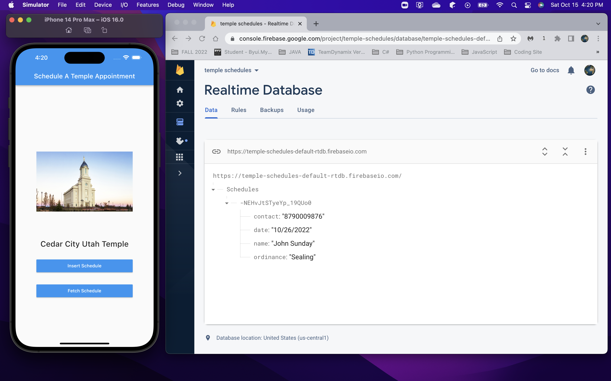
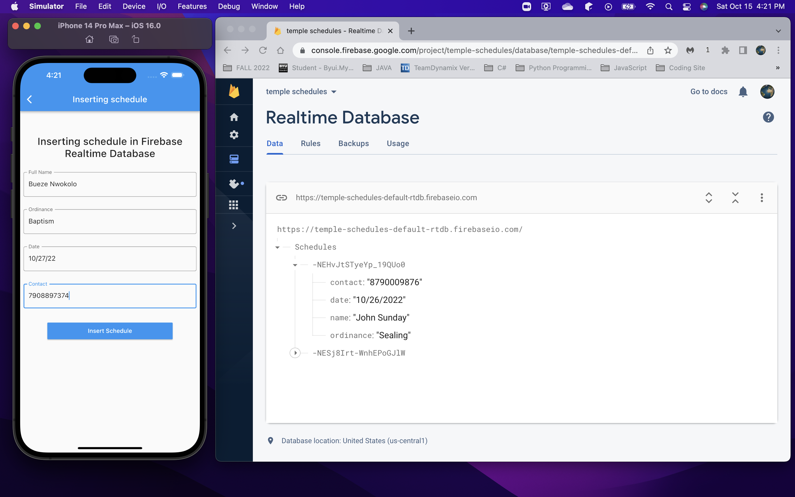
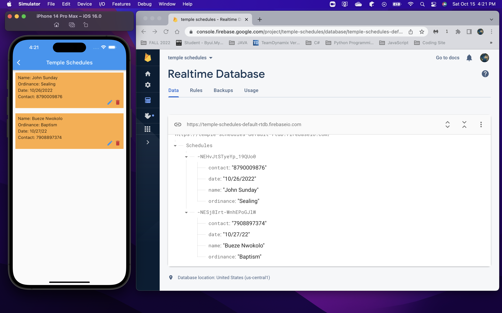
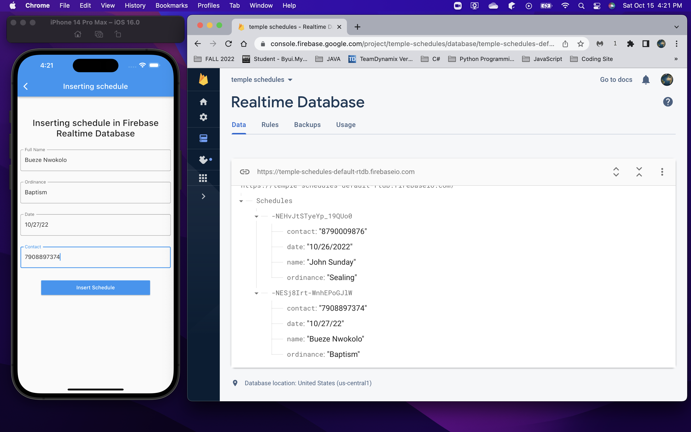

# Temple Schedules

This application was written using flutter framework and dart programing language. Find out more about flutter and dart [here](https://firebase.google.com/docs/database/flutter/read-and-write)

### Cloud Database
Cloud data storage is a convenient solution which removes the requirement for an individual or company to maintain their own database server. There are tools like Amazon DynamoDB, MongoDB and Google Firebase that provides database solution which you can access using APIs.

This project was created with the aim of learning basic CRUD operations using Google Firebase Realtime Database.

### YouTube Video
I have recorded a youtube video to demonstrate the basic functionalities of this project. Here is a [link](https://youtu.be/Ippx5MQXGTc) to watch the video.

### Tech Stack
Here is a list of the IDE and technologies I used while working on this project

- Android Studio
- Flutter Development Framework
- Dart programming language
- Google Firebase Realtime Database

### References and Credits

- [CodingZest](https://codingzest.com/)
- [The Net Ninja](https://www.youtube.com/watch?v=sfA3NWDBPZ4&list=PL3eDQApKkt-OAhR6cqE0kCBjG1mWXohBk&index=1)

### Picture Time

Home Screen

Insert Data

Fetch Data

Update Data

